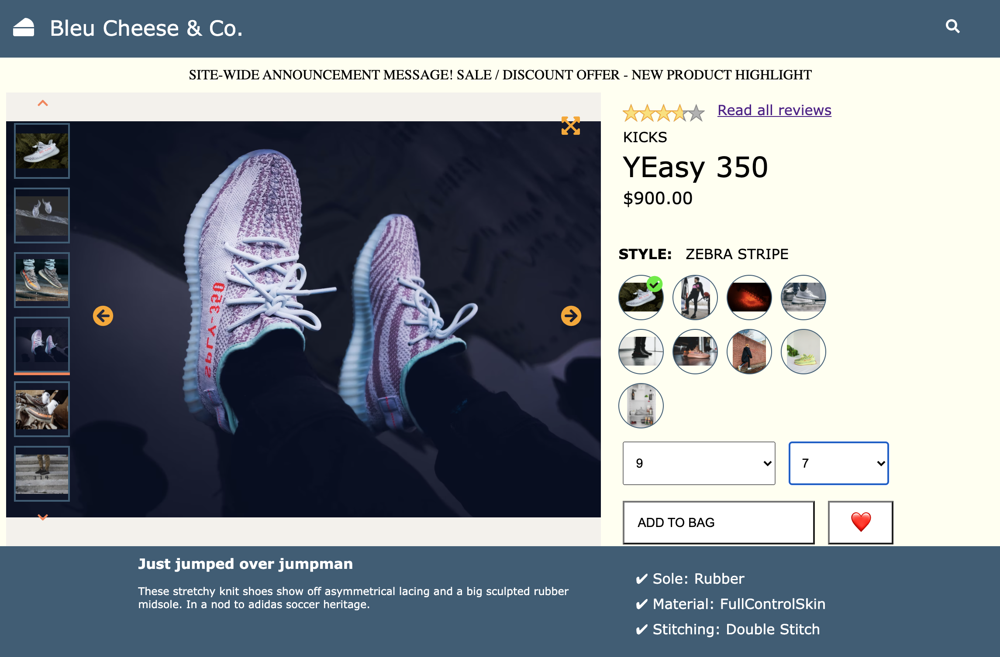

# 👋 Welcome to `Project Atelier`

🎉 ***A front-end solution for a dynamic and interactive product details page.*** 🎉

**Problem**:
This project was launched to assist an enterprise in both scaling and deploying it's outdated product details page. The client requested that their products API be used to serve the web app, and that interactions between components meet certain requirements. Additionally, performance metrics and click-tracking were requested in order to keep their service fast and reliable.

**Solution**:
Our team delivered a web app which dynamically displays data from a products API and creates a UI/UX which is accessible, interactice, and fun. Users can browse product styles, find related products, ask questions and get answers, and check out reviews! Items can be added to a 'My Outfit' carousel which displays favorite outfits, compare products to other user feedback, and all item sizes and quantites can be easily purchased. User behavior is tracked with click-handlers in components and Project Atelier meets performance requirements when deployed.

## 🎥 Demo


## 📋 Features

- Product Overview
- Related Products
- Q&A
- Ratings & Reviews
- Click-Tracking
- High Performance


## 💾 Installation

1. Clone the repository.
   ```sh
   git clone https://github.com/rpp31-fec-bleu-cheese/project-atelier
   ```
2. To access the API, acquire a personal access token from https://github.com/ and insert the token into a ```config.js``` file.
3. Install NPM packages.
   ```sh
   npm install
    ```
3. Compile Webpack.
   ```sh
   npm run build
    ```
4. Start the server.
   ```sh
   npm start
    ```
5. Open on localhost:3000 or your preferred deployment!

## ⚗️ Usage/Examples

Watch a product ID with useEffect and pass down your product details:
```javascript
useEffect (() => {
    let productIdOptions = {
      url: `/products/${productId}`,
      method: 'get'
    };
    let productStylesOptions = {
      url: `/products/${productId}/styles`,
      method: 'get'
    };
    axios(productIdOptions)
      .then(response => {
        let product = {
          details: response.data
        };
        axios(productStylesOptions)
        .then(response => {
          product.styles = response.data;
          setIndexes({...indexes, style: 0, photo: 0})
          updateDetailsAndStyles(product.details, product.styles);
            })
          })
        .catch(error => {
            console.log(error)});
  }, [productId]);
```
Set up your products API with custom routes and controllers on our Express server:
```javascript
app.get('/products', controllers.products.getAllProducts);
app.get('/products/:product_id', controllers.products.getProductByID);
app.get('/products/:product_id/styles', controllers.products.getProductStyleByID);
app.get('/products/:product_id/related', controllers.products.getRelatedProductsByID);

app.get('/products/related/details', controllers.products.getDetailsForProducts);
app.get('/products/outfit/details', middleware.setCookies, controllers.products.getDetailsForProducts);

app.get('/cookies', controllers.cookies.getCookies);

app.get('/qa/questions/', controllers.questions_answers.getAllQuestions);
app.post('/qa/questions/', controllers.questions_answers.postQuestion);
app.put('/qa/questions/:question_id/helpful', controllers.questions_answers.updateQuestionHelpfulness);

app.put('/qa/answers/:answer_id/helpful', controllers.questions_answers.updateAnswerHelpfulness);
app.put('/qa/answers/:answer_id/report', controllers.questions_answers.reportAnswer);
app.post('/qa/questions/:question_id/answers', controllers.questions_answers.postAnswer);

app.get('/reviews', controllers.reviews.getAllReviews);
app.post('/reviews', controllers.reviews.postReviews);
app.get('/reviews/meta', controllers.reviews.getReviewsMeta);
app.put('/reviews/helpful', controllers.reviews.markHelpful);
app.put('/reviews/:review_id/report', controllers.reviews.reportReview);

app.get('/cart', controllers.cart.getProductsInCart);
app.post('/cart', controllers.cart.postProductToCart);

app.post('/interactions', controllers.interactions.postInteraction);
```


## 🧪 Running Tests

To run tests using Jest, Enzyme, and React Testing Library, run the following command

```bash
  npm run test
```
-- or --

```bash
  npm run test test/<a single test directory here>
```


## ⛰️ Environment Variables

To run this project in production or as a deployment, you will need to add the following environment variables to your .env file

`API_KEY=<your API key here>`

`ANOTHER_API_KEY=<another API key here>`


## ⚙️ Optimizations

**Accessibility:** Considerations were made for accessibility by including alt attributes in images and clickable features. Additionally, tests were run with considerations to W3C roles for HTML elements.
**Performance:** Performance increases were achieved by manually minifying JS and CSS, adding a meta tag to the index.html file, using gzip compression on the server, using in-line styles for images, and running Webpack in production mode.


## 💻 Tech Stack

* [Express](https://expressjs.com/)
* [React](https://reactjs.org/)
* [NodeJS](https://nodejs.dev/)
* [Babel](https://babeljs.io/)
* [Webpack](https://webpack.js.org/)
* [Jest](https://jestjs.io/docs/expect)
* [Enzyme](https://enzymejs.github.io/enzyme/)
* [React Testing Library](https://github.com/testing-library/react-testing-library)


## 🤖 Authors

* Cameron Colaco - Product Overview
  * https://github.com/cameron-colaco
* Sangeetha Nair - Related Products
  * https://github.com/SangeeNair
* Chris Turcios - Question and Answers
  * https://github.com/ChrisDT93
* Josh Fuqua - Rating and Reviews
  * https://github.com/joshdfuqua


## 🔊 Acknowledgements

 - [Hack Reactor](https://www.hackreactor.com/)
    * A special thank you to Hack Reactor!

## 🛠 Skills
Javascript, HTML, CSS, AWS


## 🔗 Links
[](https://github.com/)
[](https://www.linkedin.com/)
[](https://twitter.com/)


## 📷 Screenshots
**Product Overview**



**Related Products**


**Questions and Answers**


**Ratings and Reviews**


**Performance**


